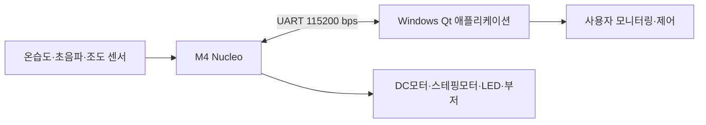

# home_plus
home iot

## Qt 클라이언트 구조

`mainwindow.h` / `mainwindow.cpp` / `mainwindow.ui`로 구성된 Windows Qt 애플리케이션의 화면 구성과 기능별 구현 현황입니다. UART 프레임 파싱·명령 송신 리팩터링(주석에 `[UART]`로 표시된 부분)은 팀원 3,4 담당이라 이 문서에서는 다루지 않고, 그 외 화면·기능은 팀원2가 구현했습니다.

### 화면 구성

```
MainWindow
├─ 상단 바
│   ├─ COM 포트 선택 · 새로고침
│   ├─ 연결 / 해제 버튼
│   └─ 연결 상태 표시 (●연결됨 / ●연결 안 됨)
│
├─ 실내 환경 (온도 · 습도 · 조도 · 현관문 카드)
│   ├─ 온도 · 습도 · 조도 카드: 클릭하면 로그 영역에 해당 센서의 기록 그래프 표시
│   └─ 현관문 카드: 클릭하면 로그 영역에 출입 로그 목록 표시
│
├─ 로그 영역 (카드 선택에 따라 아래 셋 중 하나로 전환)
│   ├─ 기록 그래프 (온도/습도/조도)
│   ├─ 출입 로그 목록 (현관문)
│   └─ "표시할 기록 없음" 안내 문구 (선택은 됐지만 기록이 아직 없을 때)
│
├─ 장치 제어
│   ├─ 전등 ON / OFF
│   ├─ 제습 ON / OFF
│   └─ 창문 닫기 / 25% / 50% / 75% / 100%
│
└─ 알람
    ├─ 시각 선택 및 설정 / 해제 버튼
    └─ 등록된 알람 목록 (다중 등록, 개별 해제 가능)
```

### 연결 관리

- 115200bps, 8N1, 흐름제어 없음으로 시리얼 포트 연결
- 케이블 분리(물리적 단절)와 응답 없음(논리적 단절, `linkTimeoutMs` 초과)을 모두 감지해 자동으로 연결 해제 처리
- 연결이 끊기면(수동 해제·자동 단절 모두) 장치 제어 버튼(전등/제습/창문)이 비활성화되고, 실내 환경 카드 값은 프로그램 시작 시와 동일한 초기 상태(`-- ℃`, `-- %`, `--`)로 되돌아감

### 센서 값 표시 인터페이스

UART 프레임 파싱 결과(팀원 3,4 담당)를 받아 화면에 반영하는 4개의 공개 슬롯을 제공합니다.

```cpp
void updateTemperature(double celsiusValue);
void updateHumidity(double percentValue);
void updateDistance(double centimeterValue);   // 임계 거리 기준으로 현관문 열림/닫힘 판정
void updateIlluminance(double percentValue);
```

### 장치 제어 명령

버튼 클릭 시 아래 5byte 프레임에 대응하는 명령이 전송됩니다.

| 조작 | 전송 프레임 |
| --- | --- |
| 전등 ON / OFF | `L0001` / `L0000` |
| 제습 ON / OFF | `D0001` / `D0000` |
| 창문 닫기 / 25% / 50% / 75% / 100% | `S0000` / `S0025` / `S0050` / `S0075` / `S0100` |
| 알람 시작 / 종료 | `A0001` / `A0000` |

### 알람 기능

- 여러 개의 알람을 동시에 등록 가능
- 설정한 시각이 되면 알람이 울리기 시작하고(전등 ON 버튼이 함께 눌려 `L0001`도 전송됨), 목록 항목에 "(울리는 중)" 표시
- `alarmDurationMs` 후 자동으로 꺼지며, 울렸던 알람은 목록에서 자동 삭제 (1회성)
- 목록에서 개별 알람을 선택해 해제 가능 (울리는 중인 알람을 해제하면 즉시 꺼짐)

### 센서 기록 그래프

- 온도·습도·조도 카드를 클릭하면 로그 영역에 해당 센서의 기록을 선 그래프로 표시
- X축은 실제 시각(`HH:mm`), Y축은 센서별 고정 범위 (온도 0~50℃, 습도 20~90%, 조도 0~100%)
- `chartSampleIntervalMs` 주기로 값을 기록하며, 첫 값은 주기를 기다리지 않고 즉시 기록. 최근 `chartHistoryMaxPoints`개만 유지
- 기록이 1개뿐일 때는 점 하나만 표시, 2개 이상부터 선으로 연결 (눈금 개수도 기록 개수에 맞춰 조정해 중복 시각 표시 방지)
- 카드를 선택 해제하면 그래프 자체가 사라지고, 기록이 아직 없으면 "표시할 기록 없음" 안내로 대체
- 재연결 시 이전 기록은 모두 초기화

### 현관문 출입 로그

- 초음파 거리값이 "닫힘 → 열림"으로 바뀌는 시점만 출입 시각으로 기록 (열림→닫힘 전환이나 단순 유지는 기록하지 않음)
- 연결 직후 첫 거리값은 전환으로 취급하지 않아 잘못된 로그가 찍히지 않도록 처리
- 현관문 카드 클릭 시 로그 영역에 최신순으로 표시되는 스크롤 목록으로 확인 가능 (`yyyy-MM-dd HH:mm:ss` 형식)
- 최대 `doorLogMaxEntries`개 보관, 초과 시 오래된 기록부터 삭제
- 연결 해제/재연결과 무관하게 계속 유지되는 출입 이력

### 주요 상수

| 상수 | 값 | 의미 |
| --- | --- | --- |
| `watchdogIntervalMs` | 1000ms | 연결 상태 점검 주기 |
| `linkTimeoutMs` | 10000ms | 응답 없음(논리적 단절) 판단 기준 |
| `doorClosedThresholdCm` | 10.0cm | 현관문 닫힘 판정 임계 거리 (임시값, 확정 필요) |
| `alarmCheckIntervalMs` | 1000ms | 알람 시각 확인 주기 |
| `alarmDurationMs` | (조정 가능) | 알람 지속 시간 |
| `chartSampleIntervalMs` | (조정 가능, 기본 1분) | 그래프 기록 샘플링 주기 |
| `chartHistoryMaxPoints` | 60개 | 그래프에 보관할 최대 샘플 개수 |
| `temperatureAxisMin` / `Max` | 0 ~ 50 | 온도 그래프 Y축 고정 범위 |
| `humidityAxisMin` / `Max` | 20 ~ 90 | 습도 그래프 Y축 고정 범위 |
| `illuminanceAxisMin` / `Max` | 0 ~ 100 | 조도 그래프 Y축 고정 범위 |
| `doorLogMaxEntries` | 50개 | 출입 로그에 보관할 최대 개수 |

M4 Nucleo 보드와 Windows용 Qt 애플리케이션을 UART로 연결하여 실내 환경을 확인하고 조명, 모터, 알람을 제어하는 홈 IoT 월패드 프로젝트입니다.

## 주요 기능

- 온도·습도 측정 및 Qt 화면 표시
- 초음파센서를 이용한 거리 측정과 현관문 상태 확인
- 조도 측정 및 Qt 화면 표시
- Qt에서 LED 조명 ON/OFF
- Qt에서 DC모터 ON/OFF
- 스테핑모터 PWM 제어
- 설정한 시각에 LED와 부저를 동작시키는 알람
- M4와 Qt 간 UART 통신

## 개발 환경

| 구분 | 환경 |
| --- | --- |
| MCU | M4 Nucleo 보드 (정확한 모델명 TBD) |
| PC 운영체제 | Windows 11 64-bit |
| GUI | Qt Creator 6.11.1 |
| MCU-PC 통신 | UART |
| 펌웨어 개발환경 | TBD |

## 시스템 구성



## 팀원 및 역할

이름과 GitHub 주소는 팀 구성 확정 후 작성합니다.

| 구분 | 이름 | GitHub 주소 | 담당 분야 |
| --- | --- | --- | --- |
| 팀원 1 | 이양배 | https://github.com/twotwoship | M4 센서·입력 M4 출력·액추에이터 |
| 팀원 2 | 이호윤 | https://github.com/nooyoh | Qt 애플리케이션·UI |
| 팀원 3 | 한수근 | https://github.com/usernamesg | M4 UART·시스템 통합·테스트 |
| 팀원 4 | 한소영 | https://github.com/hsy1030h-wq | Qt UART·시스템 통합·테스트 |

### 팀원 1 — M4 센서·입력  M4 출력·액추에이터

담당 업무:

- 온도·습도 센서 측정
- 초음파 거리 측정
- 조도센서 ADC 측정
- 센서값 보정 및 유효 범위 처리
- 센서 측정 주기 관리
- UART 모듈에 전달할 센서 데이터 제공
- 센서 단독 테스트 및 핀 연결표 작성
- DC모터 ON/OFF 제어
- 스테핑모터 방향·속도·스텝 제어
- LED ON/OFF 제어
- 부저 및 알람 패턴 제어
- 타이머·PWM 설정
- 장치 단독 테스트 및 모터 드라이버 회로 정리

### 팀원 2 — Qt 애플리케이션·UI

담당 업무:

- 메인 화면 및 장치 상태 화면 제작
- COM 포트 검색·선택 및 연결·해제 UI
- 온도·습도·거리·조도 데이터 표시
- LED, DC모터, 스테핑모터 제어 화면
- 알람 시각 설정 및 알람 해제
- UART 연결 및 센서 오류 표시
- 필요한 경우 통신 로그와 센서 그래프 표시

- [ ] 현관문 열림·닫힘 판정 기준
- [ ] 알람 관리 주체(Qt), 반복 여부 및 동작 시간


### 팀원 3,4 — M4, Qt UART·시스템 통합·테스트

담당 업무:

- UART 프로토콜 최종 정의 및 문서화
- M4 UART 송수신 코드 구현
- Qt 프레임 생성·파싱 로직 구현 지원
- 수신 버퍼, 타임아웃, 잘못된 프레임 처리
- M4 센서·출력 모듈 통합
- Qt와 M4 연동 시험
- 전체 테스트 시나리오 및 결과 관리

- [ ] 통신 장애 시 출력 장치의 안전 상태
- [ ] 명령 처리 결과 응답(ACK/ERR)과 타임아웃 정책

## UART 통신 명세

### 기본 설정

| 항목 | 값 |
| --- | --- |
| 전송 속도 | 115200 baud |
| 데이터 비트 | 8 bit |
| 패리티 | None |
| 정지 비트 | 1 bit |
| 흐름 제어 | None |
| 문자 형식 | ASCII 대문자 및 숫자 |
| PC 포트 | 실행 환경에서 선택 |

### 프레임 잠정안

```text
명령 1 byte + 데이터 4 byte
```

- 총 프레임 길이: 5 byte
- 데이터는 ASCII 숫자 네 자리로 표현
- 짧은 값은 앞을 `0`으로 채움
- 아래 명령과 데이터 범위는 통합 전에 최종 확정 필요

### M4 → Qt

| 프레임 예시 | 의미 |
| --- | --- |
| `T0235` | 온도 23.5 ℃|
| `H0678` | 습도 67.8 % |
| `U0125` | 초음파 거리 125 cm |
| `B0075` | 조도 75 % |

### Qt → M4

| 프레임 예시 | 의미 |
| --- | --- |
| `L0000` / `L0001` | LED OFF / ON |
| `D0000` / `D0001` | DC모터 OFF / ON |
| `S0090` | 스테핑모터 제어값 90 (값의 의미 TBD) |
| `A0000` / `A0001` | 알람 OFF / ON |

## 개발 전 확정 사항

- [ ] UART 프레임과 종료 문자 - 없음
- [ ] 자동제어와 수동제어의 우선순위 / 수동제어만 사용

## 개발 일정

| 단계 | 주요 작업 |
| --- | --- |
| 1일 차 | 부품·핀·프로토콜 확정, 센서·모터 단독 시험, Qt 기본 UI, UART 송수신 시험 |
| 1일 차 | 센서, 액추에이터, Qt UI, UART 프레임 파서 병렬 구현 |
| 1일 차 | 센서값 표시, Qt 장치 제어, 연결 해제·재연결 및 오류 프레임 시험 |
| 2일 차 | 알람·자동제어 통합, 문 상태 판정, 장시간 시험, 발표·보고서 준비 |

## 협업 방식

1. 저장소를 복제하고 자신의 기능 브랜치로 이동합니다.

   ```bash
   git clone <저장소-주소>
   cd home_plus
   git fetch origin
   git switch <담당-브랜치>
   ```

2. 담당 기능을 구현하고 단독 테스트를 수행합니다.
3. 변경 내용을 커밋하고 원격 기능 브랜치에 푸시합니다.
4. 기능 브랜치에서 `main` 브랜치로 Pull Request를 생성합니다.
5. 통합 담당자의 리뷰와 테스트를 거쳐 병합합니다.
6. 문제는 Pull Request 리뷰 또는 GitHub Issue로 기록하고 해결합니다.

### 권장 브랜치

| 브랜치 | 용도 |
| --- | --- |
| `main` | 검증이 끝난 통합 코드 |
| `feature/m4-sensors` | M4 센서·입력 |
| `feature/m4-actuators` | M4 출력·액추에이터 |
| `feature/qt-ui` | Qt 애플리케이션·UI |
| `feature/uart-integration` | UART·시스템 통합 |

### 커밋 규칙

커밋 메시지는 변경 목적을 알 수 있도록 작성합니다.

```text
<type>: <변경 내용>
```

예시:

```text
feat: 초음파 거리 측정 추가
fix: UART 불완전 프레임 처리 수정
docs: 핀 연결표 업데이트
test: LED 명령 수신 테스트 추가
```

권장 타입:

- `feat`: 기능 추가
- `fix`: 오류 수정
- `docs`: 문서 변경
- `refactor`: 기능 변화 없는 코드 개선
- `test`: 테스트 추가·수정
- `chore`: 설정 및 기타 작업

### Pull Request 규칙

- 제목에 담당 기능과 핵심 변경 내용을 작성합니다.
- 본문에 작업 기간, 작업자, 테스트 결과를 기록합니다.
- 관련 Issue가 있다면 함께 연결합니다.
- 다른 담당 영역과 연결되는 인터페이스 변경은 팀원 전원의 확인을 받습니다.

```text
[M4 Sensor] 온습도 측정 및 UART 데이터 연동
작업 기간: YYYY-MM-DD ~ YYYY-MM-DD
작업자:
테스트 결과:
```

## 문서화 원칙

- 모든 소스 파일 상단에 파일의 역할과 주요 기능을 기록합니다.
- 통신 규칙은 `protocol.md`, 핀 배치는 `sensors-act readme.md`에서 관리할 예정입니다.
- 프로토콜이나 공용 인터페이스를 변경하면 구현 코드와 문서를 같은 Pull Request에서 함께 수정합니다.

## License

라이선스는 추후 결정합니다.
