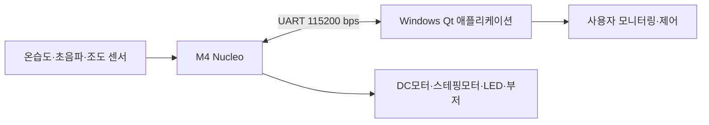

# home_plus

Qt의 QSerialPort를 이용하여 M4와 UART통신을 구현한다.

주요 기능은 다음과 같다.

## 주요 기능

- 온도·습도 측정 및 Qt 화면 표시
- 초음파센서를 이용한 거리 측정과 현관문 상태 확인
- 조도 측정 및 Qt 화면 표시
- Qt에서 LED 조명 ON/OFF
- Qt에서 DC모터 ON/OFF
- 스테핑모터 PWM 제어
- 설정한 시각에 LED와 부저를 동작시키는 알람
- M4와 Qt 간 UART 통신

## 개발 환경

| 구분 | 환경 |
| --- | --- |
| MCU | M4 Nucleo 보드 (정확한 모델명 TBD) |
| PC 운영체제 | Windows 11 64-bit |
| GUI | Qt Creator 6.11.1 |
| MCU-PC 통신 | UART |
| 펌웨어 개발환경 | TBD |

## 시스템 구성



## 팀원 및 역할

이름과 GitHub 주소는 팀 구성 확정 후 작성합니다.

| 구분 | 이름 | GitHub 주소 | 담당 분야 |
| --- | --- | --- | --- |
| 팀원 1 | 이양배 | https://github.com/twotwoship | M4 센서·입력 M4 출력·액추에이터 |
| 팀원 2 | 이호윤 | https://github.com/nooyoh | Qt 애플리케이션·UI |
| 팀원 3 | 한수근 | https://github.com/usernamesg | M4 UART·시스템 통합·테스트 |
| 팀원 4 | 한소영 | https://github.com/hsy1030h-wq | Qt UART·시스템 통합·테스트 |

### 팀원 1 — M4 센서·입력  M4 출력·액추에이터

담당 업무:

- 온도·습도 센서 측정
- 초음파 거리 측정
- 조도센서 ADC 측정
- 센서값 보정 및 유효 범위 처리
- 센서 측정 주기 관리
- UART 모듈에 전달할 센서 데이터 제공
- 센서 단독 테스트 및 핀 연결표 작성
- DC모터 ON/OFF 제어
- 스테핑모터 방향·속도·스텝 제어
- LED ON/OFF 제어
- 부저 및 알람 패턴 제어
- 타이머·PWM 설정
- 비정상 명령과 통신 장애 발생 시 안전 정지
- 장치 단독 테스트 및 모터 드라이버 회로 정리

- [ ] 센서값 단위, 범위, 정밀도 및 전송 주기
- [ ] 스테핑모터 데이터의 의미(스텝 수·각도·속도·목표 위치)
- [ ] 스테핑모터 방향 전달 방식과 원점·리미트 스위치 사용 여부


### 팀원 2 — Qt 애플리케이션·UI

담당 업무:

- 메인 화면 및 장치 상태 화면 제작
- COM 포트 검색·선택 및 연결·해제 UI
- 온도·습도·거리·조도 데이터 표시
- LED, DC모터, 스테핑모터 제어 화면
- 알람 시각 설정 및 알람 해제
- UART 연결 및 센서 오류 표시
- 필요한 경우 통신 로그와 센서 그래프 표시

- [ ] 현관문 열림·닫힘 판정 기준
- [ ] 알람 관리 주체(Qt), 반복 여부 및 동작 시간


### 팀원 3,4 — M4, Qt UART·시스템 통합·테스트

담당 업무:

- UART 프로토콜 최종 정의 및 문서화
- M4 UART 송수신 코드 구현
- Qt 프레임 생성·파싱 로직 구현 지원
- 수신 버퍼, 타임아웃, 잘못된 프레임 처리
- M4 센서·출력 모듈 통합
- Qt와 M4 연동 시험
- 전체 테스트 시나리오 및 결과 관리

- [ ] 통신 장애 시 출력 장치의 안전 상태
- [ ] 명령 처리 결과 응답(ACK/ERR)과 타임아웃 정책

## UART 통신 명세

### 기본 설정

| 항목 | 값 |
| --- | --- |
| 전송 속도 | 115200 baud |
| 데이터 비트 | 8 bit |
| 패리티 | None |
| 정지 비트 | 1 bit |
| 흐름 제어 | None |
| 문자 형식 | ASCII 대문자 및 숫자 |
| PC 포트 | 실행 환경에서 선택 |

### 프레임 잠정안

```text
명령 1 byte + 데이터 4 byte
```

- 총 프레임 길이: 5 byte
- 데이터는 ASCII 숫자 네 자리로 표현 / 온도습도의 경우 바이너리로
- 짧은 값은 앞을 `0`으로 채움
- 아래 명령과 데이터 범위는 통합 전에 최종 확정 필요

### M4 → Qt

| 프레임 예시 | 의미 |
| --- | --- |
| `T@@@@` | 온도 23.5 ℃ | 습도 67.8 % |
| `U0125` | 초음파 거리 125 cm |
| `B0075` | 조도 75 % |

### Qt → M4

| 프레임 예시 | 의미 |
| --- | --- |
| `L0000` / `L0001` | LED OFF / ON |
| `D0000` / `D0001` | DC모터 OFF / ON |
| `S0090` | 스테핑모터 제어값 90 (값의 의미 TBD) |
| `A0000` / `A0001` | 알람 OFF / ON |

## 개발 전 확정 사항

- [ ] UART 프레임과 종료 문자 - 없음
- [ ] 자동제어와 수동제어의 우선순위 / 수동제어만 사용

## 개발 일정

| 단계 | 주요 작업 |
| --- | --- |
| 1일 차 | 부품·핀·프로토콜 확정, 센서·모터 단독 시험, Qt 기본 UI, UART 송수신 시험 |
| 1일 차 | 센서, 액추에이터, Qt UI, UART 프레임 파서 병렬 구현 |
| 1일 차 | 센서값 표시, Qt 장치 제어, 연결 해제·재연결 및 오류 프레임 시험 |
| 2일 차 | 알람·자동제어 통합, 문 상태 판정, 장시간 시험, 발표·보고서 준비 |

## 협업 방식

1. 저장소를 복제하고 자신의 기능 브랜치로 이동합니다.

   ```bash
   git clone <저장소-주소>
   cd home_plus
   git fetch origin
   git switch <담당-브랜치>
   ```

2. 담당 기능을 구현하고 단독 테스트를 수행합니다.
3. 변경 내용을 커밋하고 원격 기능 브랜치에 푸시합니다.
4. 기능 브랜치에서 `main` 브랜치로 Pull Request를 생성합니다.
5. 통합 담당자의 리뷰와 테스트를 거쳐 병합합니다.
6. 문제는 Pull Request 리뷰 또는 GitHub Issue로 기록하고 해결합니다.

### 권장 브랜치

| 브랜치 | 용도 |
| --- | --- |
| `main` | 검증이 끝난 통합 코드 |
| `feature/m4-sensors` | M4 센서·입력 |
| `feature/m4-actuators` | M4 출력·액추에이터 |
| `feature/qt-ui` | Qt 애플리케이션·UI |
| `feature/uart-integration` | UART·시스템 통합 |

### 커밋 규칙

커밋 메시지는 변경 목적을 알 수 있도록 작성합니다.

```text
<type>: <변경 내용>
```

예시:

```text
feat: 초음파 거리 측정 추가
fix: UART 불완전 프레임 처리 수정
docs: 핀 연결표 업데이트
test: LED 명령 수신 테스트 추가
```

권장 타입:

- `feat`: 기능 추가
- `fix`: 오류 수정
- `docs`: 문서 변경
- `refactor`: 기능 변화 없는 코드 개선
- `test`: 테스트 추가·수정
- `chore`: 설정 및 기타 작업

### Pull Request 규칙

- 제목에 담당 기능과 핵심 변경 내용을 작성합니다.
- 본문에 작업 기간, 작업자, 테스트 결과를 기록합니다.
- 관련 Issue가 있다면 함께 연결합니다.
- 다른 담당 영역과 연결되는 인터페이스 변경은 팀원 전원의 확인을 받습니다.

```text
[M4 Sensor] 온습도 측정 및 UART 데이터 연동
작업 기간: YYYY-MM-DD ~ YYYY-MM-DD
작업자:
테스트 결과:
```

## 문서화 원칙

- 모든 소스 파일 상단에 파일의 역할과 주요 기능을 기록합니다.
- 통신 규칙은 `protocol.md`, 핀 배치는 `pinmap.md`에서 관리할 예정입니다.
- 프로토콜이나 공용 인터페이스를 변경하면 구현 코드와 문서를 같은 Pull Request에서 함께 수정합니다.

## License

라이선스는 추후 결정합니다.
