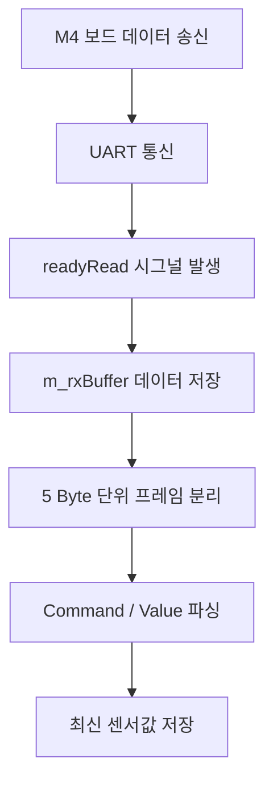
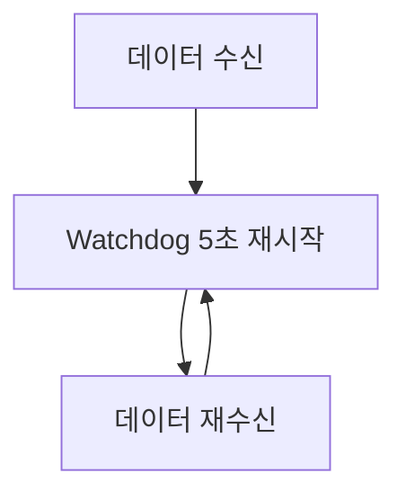
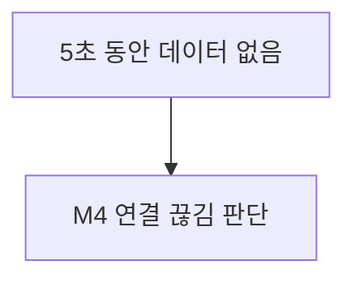

# home_plus

Qt의 QSerialPort를 이용하여 M4와 UART통신을 구현한다.

## 주요 기능
- UART 포트 초기화 및 연결
- M4 → Qt 센서 데이터 수신
- Qt → M4 제어 명령 송신
- 5바이트 데이터 프레임 파싱
- M4 통신 상태 확인

## UART 설정

| 항목 | 설정 |
| --- | --- |
| Port | COM3 |
| Baud Rate | 115200 |
| Data Bits | 8 |
| Parity | None |
| Stop Bits | 1 |
| Flow Control | None |

## 통신 프로토콜
Qt와 M4는 5바이트 고정 프레임을 사용한다.  
[Command 1Byte][Value 4Byte]

### 1. M4 ➔ Qt (데이터 송신)
| Command | 의미 | 예시 |
| :---: | :--- | :--- |
| `T` | 온도 | `T0235` ➔ 23.5℃ |
| `H` | 습도 | `H0678` ➔ 67.8% |
| `U` | 거리 | `U0125` ➔ 125cm |
| `B` | 조도 | `B0075` ➔ 75 |

### 2. Qt ➔ M4 (제어 명령 수신)

| Command | 기능 | 예시 |
| :---: | :--- | :--- |
| `L` | LED 제어 | `L0001` ➔ ON |
| `D` | DC 모터 제어 | `D0000` ➔ OFF |
| `S` | 스테핑 모터 제어 | `S0090` ➔ 90° |
| `A` | 알람 제어 | `A0001` ➔ ON |

## 주요 변수

| 변수 | 역할 |
| :--- | :--- |
| `m_serialPort` | UART 통신을 담당하는 `QSerialPort` 객체 |
| `m_rxBuffer` | 수신 데이터를 임시 저장하는 버퍼 |
| `m_latestTemperature` | 최신 온도값 |
| `m_latestHumidity` | 최신 습도값 |
| `m_latestDistance` | 최신 거리값 |
| `m_latestIlluminance` | 최신 조도값 |
| `m_isM4Connected` | M4 통신 상태 |
| `m_m4WatchdogTimer` | M4 응답 감시 타이머 |

## 주요 함수

| 함수 | 역할 |
| :--- | :--- |
| `initSerialPort()` | UART 포트 초기화 및 연결 |
| `closeSerialPort()` | UART 포트 종료 |
| `handleReadyRead()` | 수신 데이터 처리 및 5바이트 프레임 파싱 |
| `sendLedCommand()` | LED 제어 명령 송신 |
| `sendDcMotorCommand()` | DC 모터 제어 명령 송신 |
| `sendStepperCommand()` | 스테핑 모터 제어 명령 송신 |
| `sendAlarmCommand()` | 알람 제어 명령 송신 |
| `onM4WatchdogTimeout()` | M4 응답 Timeout 처리 |

## 수신 처리

UART 데이터는 `readyRead` 시그널을 통해 비동기적으로 수신한다. 수신 데이터는 `m_rxBuffer`에 저장한 후 5바이트 단위로 분리하여 처리한다.

* 💡 **버퍼 누적 처리:** UART 데이터가 한 번에 5바이트씩 들어오지 않는 경우에도 버퍼에 데이터를 누적하여 정상적으로 프레임을 구성할 수 있다.

---

## M4 통신 상태 확인

M4에서 데이터가 수신될 때마다 Watchdog Timer를 5초로 초기화한다. 5초 동안 데이터가 수신되지 않으면 M4가 응답하지 않는 상태(연결 끊김)로 판단한다.

### 🔄 정상 통신 루프

### ⚠️ 통신 단절 시 시나리오

---

## 테스트

UART 통신 테스트를 위해 테스트 버튼을 사용하여 가상의 센서 데이터를 송신할 수 있다.

* `T0235` (온도 데이터 예시)
* `H0678` (습도 데이터 예시)
* `U0125` (거리 데이터 예시)
* `B0075` (조도 데이터 예시)

이를 통해 UART 송수신, 데이터 파싱 및 저장 기능이 정상 작동하는지 직관적으로 확인한다.

---

## 핵심 구조

Qt ↔ M4 간 **5바이트 고정 프레임**을 기반으로 UART 통신을 구현하고, `QSerialPort`의 `readyRead` 시그널을 이용하여 **비동기 수신 및 데이터 파싱**을 처리한다.
