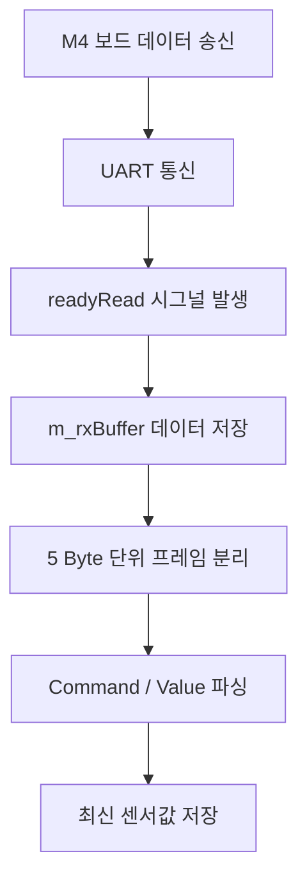
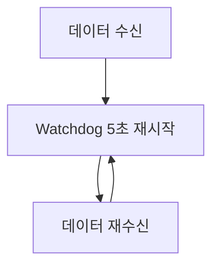
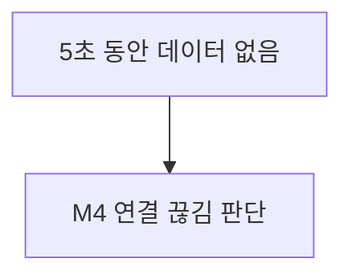
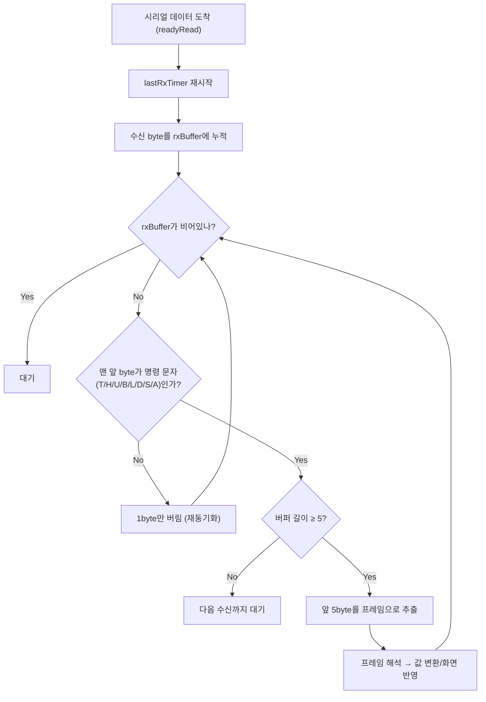
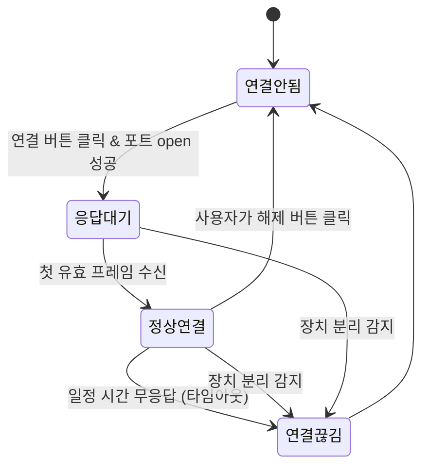

# home_plus

Qt의 QSerialPort를 이용하여 M4와 UART통신을 구현한다.

## 주요 기능
- UART 포트 초기화 및 연결
- M4 → Qt 센서 데이터 수신
- Qt → M4 제어 명령 송신
- 5바이트 데이터 프레임 파싱
- M4 통신 상태 확인

## UART 설정

| 항목 | 설정 |
| --- | --- |
| Port | COM3 |
| Baud Rate | 115200 |
| Data Bits | 8 |
| Parity | None |
| Stop Bits | 1 |
| Flow Control | None |

## 통신 프로토콜
Qt와 M4는 5바이트 고정 프레임을 사용한다.  
[Command 1Byte][Value 4Byte]

### 1. M4 ➔ Qt (데이터 송신)
| Command | 의미 | 예시 |
| :---: | :--- | :--- |
| `T` | 온도 | `T0235` ➔ 23.5℃ |
| `H` | 습도 | `H0678` ➔ 67.8% |
| `U` | 거리 | `U0125` ➔ 125cm |
| `B` | 조도 | `B0075` ➔ 75 |

### 2. Qt ➔ M4 (제어 명령 수신)

| Command | 기능 | 예시 |
| :---: | :--- | :--- |
| `L` | LED 제어 | `L0001` ➔ ON |
| `D` | DC 모터 제어 | `D0000` ➔ OFF |
| `S` | 스테핑 모터 제어 | `S0090` ➔ 90° |
| `A` | 알람 제어 | `A0001` ➔ ON |

## 주요 변수

| 변수 | 역할 |
| :--- | :--- |
| `m_serialPort` | UART 통신을 담당하는 `QSerialPort` 객체 |
| `m_rxBuffer` | 수신 데이터를 임시 저장하는 버퍼 |
| `m_latestTemperature` | 최신 온도값 |
| `m_latestHumidity` | 최신 습도값 |
| `m_latestDistance` | 최신 거리값 |
| `m_latestIlluminance` | 최신 조도값 |
| `m_isM4Connected` | M4 통신 상태 |
| `m_m4WatchdogTimer` | M4 응답 감시 타이머 |

## 주요 함수

| 함수 | 역할 |
| :--- | :--- |
| `initSerialPort()` | UART 포트 초기화 및 연결 |
| `closeSerialPort()` | UART 포트 종료 |
| `handleReadyRead()` | 수신 데이터 처리 및 5바이트 프레임 파싱 |
| `sendLedCommand()` | LED 제어 명령 송신 |
| `sendDcMotorCommand()` | DC 모터 제어 명령 송신 |
| `sendStepperCommand()` | 스테핑 모터 제어 명령 송신 |
| `sendAlarmCommand()` | 알람 제어 명령 송신 |
| `onM4WatchdogTimeout()` | M4 응답 Timeout 처리 |


## 수신 처리

UART 데이터는 `readyRead` 시그널을 통해 비동기적으로 수신한다. 수신 데이터는 `m_rxBuffer`에 저장한 후 5바이트 단위로 분리하여 처리한다.



* 💡 **버퍼 누적 처리:** UART 데이터가 한 번에 5바이트씩 들어오지 않는 경우에도 버퍼에 데이터를 누적하여 정상적으로 프레임을 구성할 수 있다.

---

## M4 통신 상태 확인

M4에서 데이터가 수신될 때마다 Watchdog Timer를 5초로 초기화한다. 5초 동안 데이터가 수신되지 않으면 M4가 응답하지 않는 상태(연결 끊김)로 판단한다.

### 🔄 정상 통신 루프


### ⚠️ 통신 단절 시 시나리오


---

## 테스트

UART 통신 테스트를 위해 테스트 버튼을 사용하여 가상의 센서 데이터를 송신할 수 있다.

* `T0235` (온도 데이터 예시)
* `H0678` (습도 데이터 예시)
* `U0125` (거리 데이터 예시)
* `B0075` (조도 데이터 예시)

이를 통해 UART 송수신, 데이터 파싱 및 저장 기능이 정상 작동하는지 직관적으로 확인한다.

---

## 핵심 구조

Qt ↔ M4 간 **5바이트 고정 프레임**을 기반으로 UART 통신을 구현하고, `QSerialPort`의 `readyRead` 시그널을 이용하여 **비동기 수신 및 데이터 파싱**을 처리한다.
---
# 🔌 UART 통신 모듈 핵심 기술

PC(Qt) ↔ M4 보드 사이의 UART(시리얼) 통신에서, **이 프로젝트가 실제로 해결한 4가지 핵심 문제**를 정리했습니다.
"UART로 데이터를 주고받는다"는 한 줄로 보이지만, 그 안에는 아래 기술들이 들어 있습니다.

---

## 📦 통신 프레임 규격

명령 1byte + 데이터 4byte(0으로 채운 10진수) = **총 5byte 고정 길이**로 프레임을 정의했습니다.

| 명령 | 의미 | 예시 | 뜻 |
|---|---|---|---|
| `T` | 온도 | `T0235` | 23.5 ℃ |
| `H` | 습도 | `H0678` | 67.8 % |
| `U` | 거리(현관문) | `U0125` | 125 cm |
| `B` | 조도 | `B0075` | 75 % |
| `L` | LED | `L0001` | ON |
| `D` | 제습기 | `D0000` | OFF |
| `S` | 창문(각도) | `S0050` | 50 % 개방 |
| `A` | 알람 | `A0001` | ON |

구분자(`\n` 등) 없이도 "몇 byte가 프레임 하나인지"를 고정 길이로 정해뒀기 때문에, 아래 모든 기술이 가능해집니다.

---

## 1️⃣ 스트림 버퍼링 & 프레임 재조립

UART는 **패킷 개념이 없는 순수 바이트 스트림**입니다. `readyRead` 콜백 한 번에 정확히 5byte가 들어온다는 보장이 없습니다.

- `T023`만 오고 `5`는 다음 콜백에 따로 올 수도 있음 (프레임이 반으로 잘림)
- `T0235H0678`처럼 두 프레임이 한 번에 뭉쳐서 올 수도 있음

**해결:** 들어오는 대로 무조건 버퍼(`rxBuffer`)에 누적하고, 5byte가 모일 때마다 앞에서부터 하나씩 잘라서 처리합니다.

```cpp
rxBuffer.append(serialPort->readAll());
while (rxBuffer.length() >= 5) {
    QByteArray frame = rxBuffer.left(5);
    rxBuffer.remove(0, 5);
    processIncomingFrame(frame);
}
```

---

## 2️⃣ 프레임 재동기화 (Resynchronization)

**왜 필요한가:** 위 방식은 "5byte씩 무조건 자르기"라서, 연결 초반 노이즈나 부팅 메시지로 **1byte라도 어긋나면 그 이후 모든 데이터가 영구히 깨집니다.**

```
정상 수신:            T0235 H0678 U0125 B0075
노이즈 1byte 섞임:      T0235 X H0678 U0125 B0075

❌ 5byte씩 무조건 자르면 (구버전)
  T0235 | XH067 | 8U012 | 5B007 | 5...
  → 온도 프레임을 습도로, 습도를 거리로 잘못 해석 → 복구 불가

✅ 명령 문자인지 검사 후 1byte만 버리며 재동기화 (개선판)
  T0235 → 정상 처리
  X     → 명령 문자 아님 → 그 1byte만 버림
  H0678 → 명령 문자 인식됨 → 정상 처리 (여기서 즉시 복구!)
```

데이터부(4byte)는 항상 숫자, 명령부는 항상 알파벳이라 겹치지 않기 때문에 "이 byte가 명령 문자인가?"만으로 프레임 시작점을 다시 찾을 수 있습니다.



---

## 3️⃣ 인코딩 / 디코딩

- **수신(디코딩):** `frame.mid(1,4).toInt()`로 문자열 → 정수 변환. 온도/습도는 실제로 `/10.0`을 적용해 소수점 값으로 복원 (`0235` → `23.5`).
- **송신(인코딩):** `QString("L%1").arg(on ? 1 : 0, 4, 10, QChar('0'))`로 정수 → "0으로 채운 4자리 문자열" 변환 (`1` → `"0001"`).

즉, PC 내부의 `double`/`bool`/`int` 값과 M4 보드가 이해하는 "고정폭 아스키 문자열" 사이를 서로 변환해주는 역할입니다.

---

## 4️⃣ 연결 상태 감시 (이중 워치독)

UART/USB-시리얼은 TCP와 달리 **"연결 종료" 시그널이 없습니다.** 케이블이 꽂혀 있어도 보드가 멈추면 OS는 아무것도 알려주지 않습니다. 그래서 **논리적 단절**과 **물리적 단절**을 각각 다른 방법으로 감시합니다.

| 구분 | 감지 방법 | 트리거 |
|---|---|---|
| 논리적 단절 | 워치독 타이머 | 마지막 수신 후 일정 시간(`linkTimeoutMs`) 응답 없음 |
| 물리적 단절 | `errorOccurred` 시그널 | 케이블 분리 등 OS가 즉시 보고하는 에러 |



포트가 "열린 것"과 실제로 M4와 "정상 통신 중인 것"을 구분해서, 상단 상태 표시가 열림=노란/대기, 첫 데이터 수신 후=초록으로 바뀝니다.

---

## 📋 한 장 요약 (슬라이드용)

| # | 기술 | 해결하는 문제 |
|---|---|---|
| 1 | 스트림 버퍼링 & 프레임 재조립 | UART는 패킷 경계가 없어, 데이터가 잘리거나 뭉쳐서 옴 |
| 2 | 프레임 재동기화 | 노이즈로 한 번 어긋나면 계속 깨지는 문제 방지 |
| 3 | 인코딩/디코딩 | 보드의 아스키 문자열 ↔ PC의 숫자/불리언 상호 변환 |
| 4 | 이중 워치독 | UART엔 없는 "연결 끊김 알림"을 소프트웨어로 직접 구현 |
